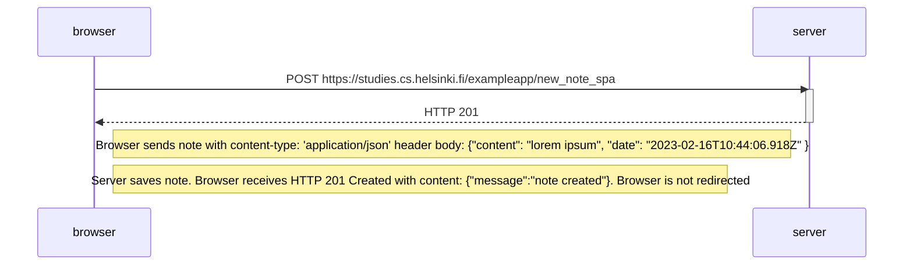

```mermaid
sequenceDiagram
    participant browser
    participant server
    
    browser->>server: POST https://studies.cs.helsinki.fi/exampleapp/new_note_spa
    activate server
    server-->>browser: HTTP 201
    deactivate server

    Note right of browser: Browser sends note with content-type: 'application/json' header body: {"content": "lorem ipsum", "date": "2023-02-16T10:44:06.918Z" }

    Note right of browser: Server saves note. Browser receives HTTP 201 Created with content: {"message":"note created"}. Browser is not redirected
```